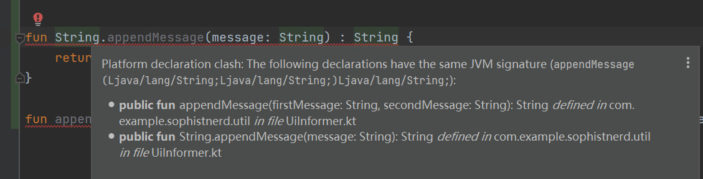
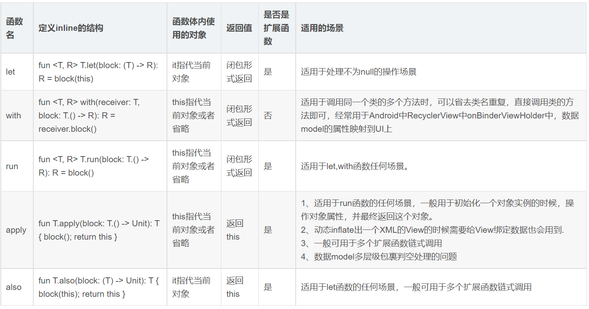

# 偏函数的使用（函数柯里化）
对一个多参数的函数，通过指定其中的一部分参数后得到的仍然是一个函数，那么这个函数就是原函数的一个偏函数了。
```kotlin
//被调用函数，待传递函数。需要两个参数，一个是定位的view，一个是消息体。前者应该是ui层传递，后者应该是业务完成后的回调。
@MainThread
fun showSnackbarMessage(anchorView: View, msg: String) {

    if (anchorView.isAttachedToWindow) {
        Snackbar.make(anchorView, msg, BaseTransientBottomBar.LENGTH_SHORT)
            .setAction("确定") {

            }
            .show()
    }
}

//调用函数，这是业务层定义，需要在业务完成后回调传递的接口
fun previous(callback: ((String) -> Unit)? = null) {
    imageSource.value?.let {
        if (it.size > 0) {
            index--
            index = abs(index % it.size)
            currentImage.value = it[index]
            "previous image : $index / ${it.size}".also { msg ->
                callback?.invoke(msg)
                logger.info(msg)
            }
        }
    }
}

//1.增加偏函数支持！！！方便传递函数参数。
//将偏函数作为扩展函数定义出来
fun <P1, P2, R> Function2<P1, P2, R>.partial1(p1: P1) = fun(p2: P2) = this(p1, p2)
fun <P1, P2, R> Function2<P1, P2, R>.partial2(p2: P2) = fun(p1: P1) = this(p1, p2)
//按照定义的偏函数使用
savedStateViewModel.search(text.trim().toString(), ::showSnackbarMessage.partial1(it))


//2.匿名函数实现
savedStateViewModel.previous(fun(msg : String){
    showSnackbarMessage(it, msg = msg)
})


//3.lambda表达式实现
savedStateViewModel.next { msg : String ->
    showSnackbarMessage(it, msg)
}
```

# 扩展函数和常规函数的关系
下面两个定义同时出现，编译器会直接报错，说两个函数的签名是一样的。

```kotlin
//扩展函数定义
fun String.appendMessage(message: String) = "$this  $message"
//常规函数定义
fun appendMessage(firstMessage : String, secondMessage : String) = "$firstMessage $secondMessage"
```


针对上面的情况，可以通过以下操作来放大问题：
```kotlin
fun main() {
    //通过提示可以看出tagFunction类型是KFunction2<String,String,String>
    var tagFunction = ::appendMessage
    //下面操作也是合法的
    tagFunction = String::appendMessage
}
```
实际上，扩展函数和常规函数可以相互赋值，因为其函数原型是一样的，如上例子类型是KFunction2<String,String,String>


# lambda表达式再思考
lambda表达式特征:
- 定义类型时以(ParameterType) -> ReturnType 
- 定义实现时以{(ParameterInstance) -> Implementation}

```kotlin
fun main() {
    //定义参数类型
    var lambdaType : (String, String) -> String = ::appendMessage
    //定义函数实现
    lambdaType = {(firstMessage, secondMessage) -> {
        "$firstMessage $secondMessagebushi"
    }}
}
```

再往前走一步，我们常见的情况：
```kotlin
//lambda作为参数传递给函数
savedStateViewModel.next({ msg : String ->
    showSnackbarMessage(it, msg)
})

//lambda作为函数最后一个参数，可以将lambda表达式从函数参数中提取出来，直接放到后面
savedStateViewModel.next { msg : String ->
    showSnackbarMessage(it, msg)
}
```

这里想要说明的一点就是：
- lambda作为函数最后一个参数，可以将lambda表达式从函数参数中提取出来，直接放到后面
- 如果函数后直接接了{}，则说明函数接受的是lambda表达式。并且，如果lambda表达式只有一个参数又可以省去形参，使用it作为形参！！！

# FunctionInterface和lambda
在Java中，如果一个接口只有一个抽象方法，那么可以直接用lambda表达式表示这个接口。

Java风格的kotlin写法如下：
```kotlin
interface MyInterface {
    fun show()
}

fun callShow(myInterface: MyInterface) {
    myInterface.show()
}

fun main() {
    callShow(object : MyInterface {
        override fun show() {
            TODO("Not yet implemented")
        }
    })

    //但是这里就无法调用了！！！
    callShow {
        println("Single Abstract Method interfaces")
    }
}
```

在Kotlin中为了实现相同的FuctionInterface转lambda表达式的操作，可以将MyInterface调整为下面的定义：
```kotlin
//注意fun interface的变化
fun interface MyInterface {
    fun show()
}

fun callShow(myInterface: MyInterface) {
    myInterface.show()
}

fun main() {
    callShow(object : MyInterface {
        override fun show() {
            TODO("Not yet implemented")
        }
    })

    //这里可以正常调用了！！！
    callShow {
        println("Single Abstract Method interfaces")
    }
}
```

所以，在Kotlin中，函数式接口完全可以直接定义为lambda表达式，或者定义为kotlin风格的function interface：
```kotlin
//1.Java风格的函数时接口
interface MyInterface {
    fun show()
}

//2.lambda表达式定义
//定义参数类型， () -> Unit
//定义函数实现
{(firstMessage, secondMessage) -> {
    "$firstMessage $secondMessagebushi"
}}

fun lambdaInterface() {
    println("lambdaInterface")
}

fun main() {
    //fuction interface的lambda表达式形式
    callShow {
        println("function interface")
    }
    //函数类型调用
    callShow(::lambdaInterface)
}

//3.kotlin风格的fuction interface定义
fun interface MyInterface {
    fun show()
}
```

对于，callShow直接传递lambda表达式的理解，按照两步走：
- 函数式接口转化为lambda表达式， MyInterface直接转换为() -> Unit类型
- lambda表达式的函数类型，() -> Unit类型正好表示不接受参数，也不返回的函数类型

所以，后续对于callShow这种需要函数式接口对象的调用，直接按照lambda表达式方式调用即可！！！
并以函数类型，实参类型，返回类型去定义lambda表达式即可。

# by lazy和 lateinit
- lateinit 只用于变量 var，而 lazy 只用于常量 val
- lateinit 则用于只能生命周期流程中进行获取或者初始化的变量，比如 Android 的 onCreate()
- lazy 应用于单例模式(if-null-then-init-else-return)，而且当且仅当变量被第一次调用的时候，委托方法才会执行

# 字段的get和set，委托
```kotlin
var <propertyName>[: <PropertyType>] [= <property_initializer>]
    [<getter>]
    [<setter>]
```


# DataBinding使用
## 配置

```groovy
apply plugin: "kotlin-kapt" // Kotlin 使用 Databinding必须添加

android {
    
    buildFeatures {
        viewBinding true
    }
}
```
## 使用
每一个layout文件都会生成一个Binding类对象，比如说layout文件夹中有个activity_main.xml文件，
那么便会被apt处理生成一个MainActivityBinding类对象。
用户侧使用，实际上就是需要在Activity、Fragment或者任何有视图绑定的地方进行管理上即可，如下就是Activity和

```kotlin
class MainActivity : AppCompatActivity() {

    private lateinit var binding: ActivityMainBinding

    override fun onCreate(savedInstanceState: Bundle?) {
        super.onCreate(savedInstanceState)

        //将activity_main.xml生成的ActivityMainBinding管理layoutInflater获取到binding对象，随后可以直接获取内部view了
        binding = ActivityMainBinding.inflate(layoutInflater)
        setContentView(binding.root)
    }
}


class ItemRecyclerViewAdapter(
    private val values: List<UnsplashPhotoWithStatus>,
    private val savedStateViewModel: MainSavedStateViewModel
) : RecyclerView.Adapter<ItemRecyclerViewAdapter.ViewHolder>() {

    //注意SupervisorJob+CoroutineExceptionHandler一起使用，才不会导致子协程崩溃影响到父协程！！！
    private val coroutineScope =
        CoroutineScope(SupervisorJob() + Dispatchers.Main.immediate + CoroutineExceptionHandler { _, exception ->
            println("CoroutineExceptionHandler got $exception")
        })

    /**
     * 注意每一个layout文件都生成了一个binding对象，按照布局名反写并加上binding后缀!!!!
     */
    override fun onCreateViewHolder(parent: ViewGroup, viewType: Int): ViewHolder {

        return ViewHolder(
            FragmentItemViewBinding.inflate(
                LayoutInflater.from(parent.context),
                parent,
                false
            )
        )
    }
}
```


# 标准库中的扩展函数
标准库standard.kt中定义了常用的扩展函数，比如常见的with、let、run、apply、also、takeIf、takeUnless、repeat、TODO等

```kotlin

/**
 * An exception is thrown to indicate that a method body remains to be implemented.
 */
public class NotImplementedError(message: String = "An operation is not implemented.") : Error(message)

/**
 * Always throws [NotImplementedError] stating that operation is not implemented.
 */

@kotlin.internal.InlineOnly
public inline fun TODO(): Nothing = throw NotImplementedError()

/**
 * Always throws [NotImplementedError] stating that operation is not implemented.
 *
 * @param reason a string explaining why the implementation is missing.
 */
@kotlin.internal.InlineOnly
public inline fun TODO(reason: String): Nothing = throw NotImplementedError("An operation is not implemented: $reason")

/**
 * Calls the specified function [block] and returns its result.
 *
 * For detailed usage information see the documentation for [scope functions](https://kotlinlang.org/docs/reference/scope-functions.html#run).
 */
@kotlin.internal.InlineOnly
public inline fun <R> run(block: () -> R): R {
    contract {
        callsInPlace(block, InvocationKind.EXACTLY_ONCE)
    }
    return block()
}

/**
 * Calls the specified function [block] with `this` value as its receiver and returns its result.
 *
 * For detailed usage information see the documentation for [scope functions](https://kotlinlang.org/docs/reference/scope-functions.html#run).
 */
@kotlin.internal.InlineOnly
public inline fun <T, R> T.run(block: T.() -> R): R {
    contract {
        callsInPlace(block, InvocationKind.EXACTLY_ONCE)
    }
    return block()
}

/**
 * Calls the specified function [block] with the given [receiver] as its receiver and returns its result.
 *
 * For detailed usage information see the documentation for [scope functions](https://kotlinlang.org/docs/reference/scope-functions.html#with).
 */
@kotlin.internal.InlineOnly
public inline fun <T, R> with(receiver: T, block: T.() -> R): R {
    contract {
        callsInPlace(block, InvocationKind.EXACTLY_ONCE)
    }
    return receiver.block()
}

/**
 * Calls the specified function [block] with `this` value as its receiver and returns `this` value.
 *
 * For detailed usage information see the documentation for [scope functions](https://kotlinlang.org/docs/reference/scope-functions.html#apply).
 */
@kotlin.internal.InlineOnly
public inline fun <T> T.apply(block: T.() -> Unit): T {
    contract {
        callsInPlace(block, InvocationKind.EXACTLY_ONCE)
    }
    block()
    return this
}

/**
 * Calls the specified function [block] with `this` value as its argument and returns `this` value.
 *
 * For detailed usage information see the documentation for [scope functions](https://kotlinlang.org/docs/reference/scope-functions.html#also).
 */
@kotlin.internal.InlineOnly
@SinceKotlin("1.1")
public inline fun <T> T.also(block: (T) -> Unit): T {
    contract {
        callsInPlace(block, InvocationKind.EXACTLY_ONCE)
    }
    block(this)
    return this
}

/**
 * Calls the specified function [block] with `this` value as its argument and returns its result.
 *
 * For detailed usage information see the documentation for [scope functions](https://kotlinlang.org/docs/reference/scope-functions.html#let).
 */
@kotlin.internal.InlineOnly
public inline fun <T, R> T.let(block: (T) -> R): R {
    contract {
        callsInPlace(block, InvocationKind.EXACTLY_ONCE)
    }
    return block(this)
}

/**
 * Returns `this` value if it satisfies the given [predicate] or `null`, if it doesn't.
 *
 * For detailed usage information see the documentation for [scope functions](https://kotlinlang.org/docs/reference/scope-functions.html#takeif-and-takeunless).
 */
@kotlin.internal.InlineOnly
@SinceKotlin("1.1")
public inline fun <T> T.takeIf(predicate: (T) -> Boolean): T? {
    contract {
        callsInPlace(predicate, InvocationKind.EXACTLY_ONCE)
    }
    return if (predicate(this)) this else null
}

/**
 * Returns `this` value if it _does not_ satisfy the given [predicate] or `null`, if it does.
 *
 * For detailed usage information see the documentation for [scope functions](https://kotlinlang.org/docs/reference/scope-functions.html#takeif-and-takeunless).
 */
@kotlin.internal.InlineOnly
@SinceKotlin("1.1")
public inline fun <T> T.takeUnless(predicate: (T) -> Boolean): T? {
    contract {
        callsInPlace(predicate, InvocationKind.EXACTLY_ONCE)
    }
    return if (!predicate(this)) this else null
}

/**
 * Executes the given function [action] specified number of [times].
 *
 * A zero-based index of current iteration is passed as a parameter to [action].
 *
 * @sample samples.misc.ControlFlow.repeat
 */
@kotlin.internal.InlineOnly
public inline fun repeat(times: Int, action: (Int) -> Unit) {
    contract { callsInPlace(action) }

    for (index in 0 until times) {
        action(index)
    }
}
```



# 泛型
## 泛型擦除问题
常规类型的泛型关系，父子关系容易理解。但是到了复合的泛型关系就不好理解了。比如：
ArrayList<Double> 和 ArrayList<Number> 的类型都是 ArrayList。
所以，泛型使用时，如何统一获取泛型的实际信息呢？

## 突破泛型擦除问题
实际上，复合类型的泛型信息还是存在字节码中的，只是常规方式无法直接获取到，可以通过以下几种方式：
- 使用parameterizedType记录类型信息(使用匿名内部类绑定父类或父接口的信息)
```kotlin
fun main() {
    
    val gt = object : GenericTypeToken<Map<String, String>>(){}
    println(gt.type)

    //Gson中获取类型的方式
    val typeToken = object : TypeToken<Map<String, Double>>() {}
    println(typeToken.type)
    println(typeToken.rawType)
}

open class GenericTypeToken<T> {
    var type : Type = Any ::class.java
    init {
        val superClass = this.javaClass.genericSuperclass
        type = (superClass as ParameterizedType).actualTypeArguments[0]
    }
}
```
- 使用内联函数获取泛型(在编译时将具体的类型插入相应的字节码中，运行时就可以获取到对应参数的类型了)
```kotlin
inline fun<reified T : Any> Gson.fromJson(json : String) : T {
    return Gson().fromJson(json, T::class.java)
}
```

## 协变、逆变、不变
- 协变：Double 是 Number子类，那么List<Double> 是 List<Number>子类。如何表示可以接受Number子类的列表类型？
```kotlin
val stringList : List<String> = ArrayList<String>()
//下面的out可以省略，将List<String>视作List<Any>的子类，就是做协变操作。
val anyList : List<out Any> = stringList
```
注意：这种情况下只能够使用anyList取数据，无法往里面写入数据的。因为这种情况会记录泛型具体类型，然后获取值是进行转型安全。
但是，你要是中间添加了数据，不知道是按照哪一种any实现类。后续获取数据就会出现转型问题了。
类比 ? extends Number
out表示泛型参数协变

- 逆变：Double 是 Number子类。如何表示可以接受Double父类的列表类型？
```kotlin
//第二个参数里面的in表示，任何T的父类实现的Comparator都可以用于子类的排序。
public fun <T> Iterable<T>.sortedWith(comparator: Comparator<in T>): List<T> {
    if (this is Collection) {
       if (size <= 1) return this.toList()
       @Suppress("UNCHECKED_CAST")
       return (toTypedArray<Any?>() as Array<T>).apply { sortWith(comparator) }.asList()
    }
    return toMutableList().apply { sortWith(comparator) }
}
```
注意：这种情况只能够按照类型设定去写数据，无法从中读取数据类型。因为任何Double父类的Comparator，获取的类型都不确定，但是
按照Double去往里面写入数据，Comparator是肯定能够生效的。
类比 ? super Double
in表示泛型参数逆变

- 不变
泛型类型初始化后不存在类型变化了。可以添加也可以读取，类型唯一性，不存在安全性问题。
