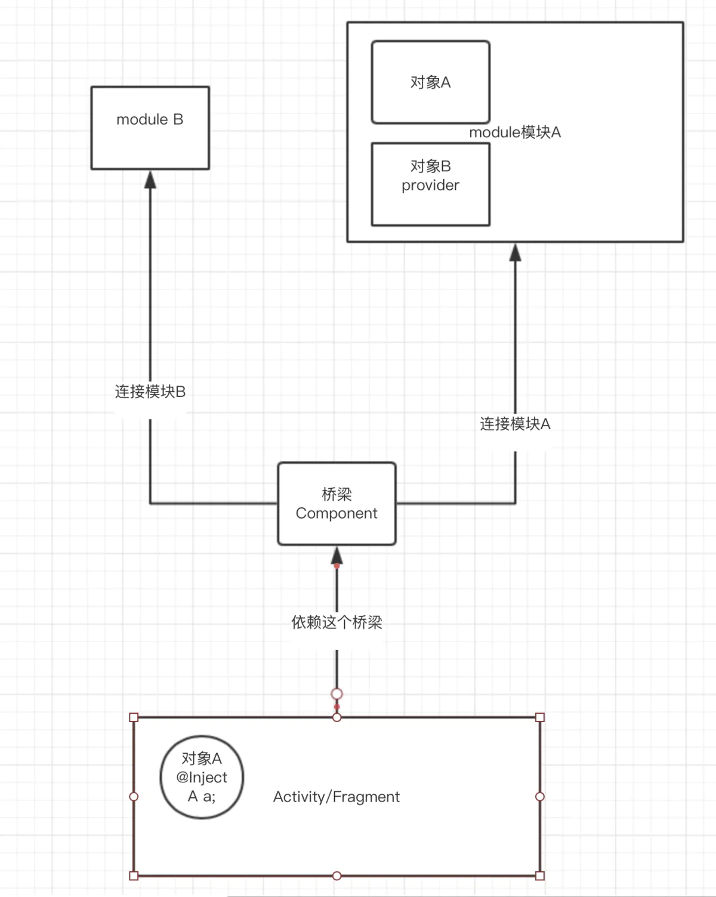

- dagger使用apt发现还是没有DaggerXXXComponent文件生成
Kotlin编译警告问题：Incremental annotation processing requested

原因：这是 kotlin-gradle-plugin 1.3.50 版本的一个bug。

解决办法：gradle.properties 文件中添加 kapt.incremental.apt = false 来禁用增量注解处理 或者 将 kotlin_version 版本降低。

```text
Dagger 是通过@Inject使用具体的某个对象，这个对象呢，是由@Provides注解提供，但是呢，这个@Provides只能在固定的模块中，也就是@Module注解，我们查找的时候，不是直接去找模块，而是去找@Component

链接：https://www.jianshu.com/p/2cd491f0da01
```


重要坑：
- Provide 如果是单例模式 对应的Compnent 也要是单例模式
- inject(Activity act) 不能放父类
- 即使使用了单利模式，在不同的Activity 对象还是不一样的
- 依赖component， component之间的Scoped 不能相同
- 子类component 依赖父类的component ，子类component的Scoped 要小于父类的Scoped，Singleton的级别是Application
- 多个Moudle 之间不能提供相同的对象实例
- Moudle 中使用了自定义的Scoped 那么对应的Compnent 使用同样的Scoped


### Component
是依赖需求方和依赖注入方之间的桥梁：
- 依赖需求方初始化构造时需要将自身注入到Component中
- Component会在依赖需求方对象构造完成前，在Module中查找，将所有的@Inject对象进行注入

### Module
对外提供依赖的模块，内部有Provider返回类对象，作为对外提供的依赖对象

### Inject
Inject会有两种使用
- 在构造函数前使用，则是提供依赖
- 在函数或者字段上使用，则是给函数提供依赖

### Scope

```text
标识范围注释。 范围注释适用于包含可注入构造函数的类，并控制注入器如何重用该类型的实例。 默认情况下，如果没有范围注解，
注入器会创建一个实例（通过注入类型的构造函数），使用该实例进行一次注入，然后忘记它。 如果存在范围注释，则注入器可能会
保留该实例，以便在以后的注入中可能重用。 如果多个线程可以访问一个作用域实例，那么它的实现应该是线程安全的。 
作用域本身的实现由注入器完成。 
```

### Singleton
表示作用域内依赖都是同一个。