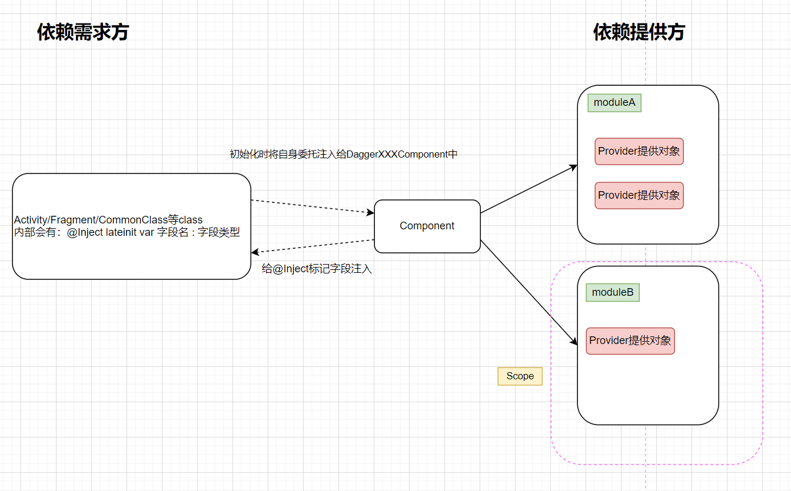
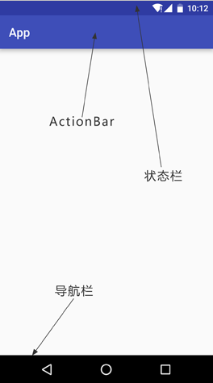
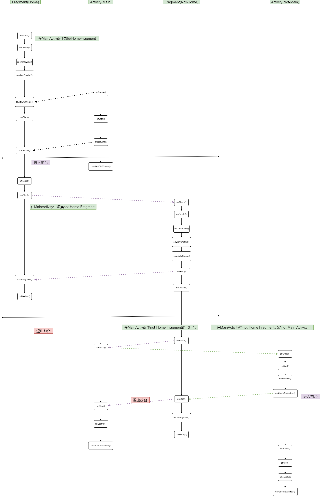

- dagger使用apt发现还是没有DaggerXXXComponent文件生成
Kotlin编译警告问题：Incremental annotation processing requested

原因：这是 kotlin-gradle-plugin 1.3.50 版本的一个bug。

解决办法：gradle.properties 文件中添加 kapt.incremental.apt = false 来禁用增量注解处理 或者 将 kotlin_version 版本降低。

```text
Dagger 是通过@Inject使用具体的某个对象，这个对象呢，是由@Provides注解提供，但是呢，这个@Provides只能在固定的模块中，也就是@Module注解，我们查找的时候，不是直接去找模块，而是去找@Component

链接：https://www.jianshu.com/p/2cd491f0da01
```




重要坑：
- Provide 如果是单例模式 对应的Compnent 也要是单例模式
- inject(Activity act) 不能放父类
- 即使使用了单利模式，在不同的Activity 对象还是不一样的
- 依赖component， component之间的Scoped 不能相同
- 子类component 依赖父类的component ，子类component的Scoped 要小于父类的Scoped，Singleton的级别是Application
- 多个Moudle 之间不能提供相同的对象实例
- Moudle 中使用了自定义的Scoped 那么对应的Compnent 使用同样的Scoped


### Component
是依赖需求方和依赖注入方之间的桥梁：
- 依赖需求方初始化构造时需要将自身注入到Component中
- Component会在依赖需求方对象构造完成前，在Module中查找，将所有的@Inject对象进行注入

### Module
对外提供依赖的模块，内部有Provider返回类对象，作为对外提供的依赖对象

### Inject
Inject会有两种使用
- 在构造函数前使用，则是提供依赖
- 在函数或者字段上使用，则是给函数提供依赖

### Scope

```text
标识范围注释。 范围注释适用于包含可注入构造函数的类，并控制注入器如何重用该类型的实例。 默认情况下，如果没有范围注解，
注入器会创建一个实例（通过注入类型的构造函数），使用该实例进行一次注入，然后忘记它。 如果存在范围注释，则注入器可能会
保留该实例，以便在以后的注入中可能重用。 如果多个线程可以访问一个作用域实例，那么它的实现应该是线程安全的。 
作用域本身的实现由注入器完成。 
```

### Singleton
表示作用域内依赖都是同一个。


# Android 状态栏, 标题栏, 导航栏，系统栏，应用栏的区别和解释


如上图，可以看到，有状态栏(status bar)、标题栏(action bar, toolbar)、导航栏(navigation bar) 等,

状态栏 (status bar)：是指手机最顶上，显示中国移动、安全卫士、电量、网速等等，在手机的顶部。下拉就会出现通知栏。
标题栏 (action bar, toolbar)：是指一个APP程序最上部的titleBar，从名字就知道它显然就是一个应用程序一个页面的标题了，例如打开QQ消息主页，最上面显示消息那一栏就是标题栏。
导航栏 (navigation bar)：是手机最下面的返回，HOME，菜单（menu/recent）三个键。
系统栏 (system bar): 等于状态栏 + 导航栏 (参考：https://developer.android.google.cn/training/system-ui/dim)
应用栏(app bar)：应用栏也称操作栏，一般是把标题栏(Toolbar) 设置为应用栏 (参考：https://developer.android.google.cn/training/appbar/)
（参考：https://blog.csdn.net/lu1024188315/article/details/74692844）
一般来说，APP实现沉浸式有三种需求：沉浸式状态栏，隐藏导航栏，APP全屏

沉浸式状态栏，是指状态栏与标题栏颜色相匹配，
隐藏导航栏，是指将导航栏隐藏，去掉下面的黑条。
APP全屏，是指将状态栏与导航栏都隐藏，例如很多游戏界面，都是APP全屏。
（参考： https://blog.csdn.net/qiyei2009/article/details/74435809）


# 生命周期


```text

2022-02-27 12:24:02.169 5780-5780/com.example.extend I/System.out: SophistNerd HomeFragment onAttach
2022-02-27 12:24:02.170 5780-5780/com.example.extend I/System.out: SophistNerd HomeFragment onCreate
2022-02-27 12:24:02.175 5780-5780/com.example.extend I/System.out: SophistNerd HomeFragment onCreateView
2022-02-27 12:24:02.176 5780-5780/com.example.extend I/System.out: SophistNerd HomeFragment onViewCreated
2022-02-27 12:24:02.237 5780-5780/com.example.extend I/System.out: SophistNerd MainActivity onCreate
2022-02-27 12:24:02.240 5780-5780/com.example.extend I/System.out: SophistNerd HomeFragment onActivityCreated
2022-02-27 12:24:02.242 5780-5780/com.example.extend I/System.out: SophistNerd HomeFragment onStart
2022-02-27 12:24:02.243 5780-5780/com.example.extend I/System.out: SophistNerd MainActivity onStart
2022-02-27 12:24:02.246 5780-5780/com.example.extend I/System.out: SophistNerd MainActivity onResume
2022-02-27 12:24:02.247 5780-5780/com.example.extend I/System.out: SophistNerd HomeFragment onResume
2022-02-27 12:24:02.280 5780-5780/com.example.extend I/System.out: SophistNerd MainActivity onAttachedToWindow
2022-02-27 12:24:28.056 5780-5780/com.example.extend I/System.out: SophistNerd HomeFragment onPause
2022-02-27 12:24:28.056 5780-5780/com.example.extend I/System.out: SophistNerd HomeFragment onStop
2022-02-27 12:24:28.056 5780-5780/com.example.extend I/System.out: SophistNerd DashboardFragment onAttach
2022-02-27 12:24:28.057 5780-5780/com.example.extend I/System.out: SophistNerd DashboardFragment onCreate
2022-02-27 12:24:28.060 5780-5780/com.example.extend I/System.out: SophistNerd DashboardFragment onCreateView
2022-02-27 12:24:28.061 5780-5780/com.example.extend I/System.out: SophistNerd DashboardFragment onViewCreated
2022-02-27 12:24:28.061 5780-5780/com.example.extend I/System.out: SophistNerd DashboardFragment onActivityCreated
2022-02-27 12:24:28.061 5780-5780/com.example.extend I/System.out: SophistNerd DashboardFragment onStart
2022-02-27 12:24:28.219 5780-5780/com.example.extend I/System.out: SophistNerd HomeFragment onDestroyView
2022-02-27 12:24:28.221 5780-5780/com.example.extend I/System.out: SophistNerd DashboardFragment onResume
2022-02-27 12:24:30.924 5780-5780/com.example.extend I/System.out: SophistNerd DashboardFragment onPause
2022-02-27 12:24:30.924 5780-5780/com.example.extend I/System.out: SophistNerd DashboardFragment onStop
2022-02-27 12:24:30.925 5780-5780/com.example.extend I/System.out: SophistNerd NotificationsFragment onAttach
2022-02-27 12:24:30.925 5780-5780/com.example.extend I/System.out: SophistNerd NotificationsFragment onCreate
2022-02-27 12:24:30.928 5780-5780/com.example.extend I/System.out: SophistNerd NotificationsFragment onCreateView
2022-02-27 12:24:30.928 5780-5780/com.example.extend I/System.out: SophistNerd NotificationsFragment onViewCreated
2022-02-27 12:24:30.929 5780-5780/com.example.extend I/System.out: SophistNerd NotificationsFragment onActivityCreated
2022-02-27 12:24:30.929 5780-5780/com.example.extend I/System.out: SophistNerd NotificationsFragment onStart
2022-02-27 12:24:31.087 5780-5780/com.example.extend I/System.out: SophistNerd DashboardFragment onDestroyView
2022-02-27 12:24:31.088 5780-5780/com.example.extend I/System.out: SophistNerd DashboardFragment onDestroy
2022-02-27 12:24:31.089 5780-5780/com.example.extend I/System.out: SophistNerd NotificationsFragment onResume
2022-02-27 12:24:45.884 2503-2503/? D/Launcher.Quickstep-TaskView: onTaskListVisibilityChanged: [id=4057 windowingMode=1 user=0 lastActiveTime=25863936] SophistNerd
2022-02-27 12:24:45.884 2503-2503/? D/Launcher.Quickstep-OplusTaskView: replaceTitleIfNeeded: getAppName: isMultiApp = false, isRedundant = false, title = SophistNerd
2022-02-27 12:24:45.893 2503-2503/? D/Launcher.Quickstep-OplusTaskView: replaceTitleIfNeeded: getAppName: isMultiApp = false, isRedundant = false, title = SophistNerd
2022-02-27 12:24:45.896 2503-2503/? D/Launcher.Quickstep-TaskView: onTaskListVisibilityChanged: [id=4057 windowingMode=1 user=0 lastActiveTime=25863936] SophistNerd
2022-02-27 12:24:45.896 2503-2503/? D/Launcher.Quickstep-OplusTaskView: replaceTitleIfNeeded: getAppName: isMultiApp = false, isRedundant = false, title = SophistNerd
2022-02-27 12:24:46.647 5780-5780/com.example.extend I/System.out: SophistNerd NotificationsFragment onPause
2022-02-27 12:24:46.648 5780-5780/com.example.extend I/System.out: SophistNerd MainActivity onPause
2022-02-27 12:24:46.664 5780-5780/com.example.extend I/System.out: SophistNerd NotificationsFragment onStop
2022-02-27 12:24:46.664 5780-5780/com.example.extend I/System.out: SophistNerd MainActivity onStop


2022-02-27 14:12:00.085 2503-2503/? D/Launcher.Quickstep-OplusTaskView: replaceTitleIfNeeded: getAppName: isMultiApp = false, isRedundant = false, title = SophistNerd
2022-02-27 14:12:00.088 2503-2503/? D/Launcher.Quickstep-OplusTaskView: replaceTitleIfNeeded: getAppName: isMultiApp = false, isRedundant = false, title = SophistNerd
2022-02-27 14:12:00.094 2503-2503/? D/Launcher.Quickstep-TaskView: onTaskListVisibilityChanged: [id=4092 windowingMode=1 user=0 lastActiveTime=33850773] SophistNerd
2022-02-27 14:12:00.094 2503-2503/? D/Launcher.Quickstep-OplusTaskView: replaceTitleIfNeeded: getAppName: isMultiApp = false, isRedundant = false, title = SophistNerd
2022-02-27 14:12:00.715 14454-14454/com.example.extend I/System.out: SophistNerd HomeFragment onPause
2022-02-27 14:12:00.715 14454-14454/com.example.extend I/System.out: SophistNerd MainActivity onPause
2022-02-27 14:12:00.742 14454-14454/com.example.extend I/System.out: SophistNerd HomeFragment onStop
2022-02-27 14:12:00.744 14454-14454/com.example.extend I/System.out: SophistNerd MainActivity onStop
2022-02-27 14:12:00.863 2503-2503/? D/Launcher.Quickstep-OplusTaskThumbnailView: cancelLightningAnimation: this = com.oplus.quickstep.views.OplusTaskThumbnailView{d4b931d V.ED..... ......ID 0,126-630,1464 #7f0a0300 app:id/snapshot}, task = [id=4092 windowingMode=1 user=0 lastActiveTime=33850773] SophistNerd, lightningAnimator = null
2022-02-27 14:12:01.223 2503-2503/? D/Launcher.Quickstep-OplusTaskThumbnailView: cancelLightningAnimation: this = com.oplus.quickstep.views.OplusTaskThumbnailView{d4b931d V.ED..... ........ 0,126-630,1464 #7f0a0300 app:id/snapshot}, task = [id=4092 windowingMode=1 user=0 lastActiveTime=33850773] SophistNerd, lightningAnimator = null
2022-02-27 14:12:02.617 14573-14573/com.example.extend I/System.out: SophistNerd HomeFragment onAttach
2022-02-27 14:12:02.617 14573-14573/com.example.extend I/System.out: SophistNerd HomeFragment onCreate
2022-02-27 14:12:02.634 14573-14573/com.example.extend I/System.out: SophistNerd HomeFragment onCreateView
2022-02-27 14:12:02.634 14573-14573/com.example.extend I/System.out: SophistNerd HomeFragment onViewCreated
2022-02-27 14:12:02.684 14573-14573/com.example.extend I/System.out: SophistNerd MainActivity onCreate
2022-02-27 14:12:02.686 14573-14573/com.example.extend I/System.out: SophistNerd HomeFragment onActivityCreated
2022-02-27 14:12:02.688 14573-14573/com.example.extend I/System.out: SophistNerd HomeFragment onStart
2022-02-27 14:12:02.688 14573-14573/com.example.extend I/System.out: SophistNerd MainActivity onStart
2022-02-27 14:12:02.690 14573-14573/com.example.extend I/System.out: SophistNerd MainActivity onResume
2022-02-27 14:12:02.691 14573-14573/com.example.extend I/System.out: SophistNerd HomeFragment onResume
2022-02-27 14:12:02.717 14573-14573/com.example.extend I/System.out: SophistNerd MainActivity onAttachedToWindow
2022-02-27 14:12:07.541 14573-14573/com.example.extend I/System.out: SophistNerd HomeFragment onPause
2022-02-27 14:12:07.542 14573-14573/com.example.extend I/System.out: SophistNerd MainActivity onPause
2022-02-27 14:12:07.575 14573-14573/com.example.extend I/System.out: SophistNerd MainActivity2 onCreate
2022-02-27 14:12:07.577 14573-14573/com.example.extend I/System.out: SophistNerd MainActivity2 onStart
2022-02-27 14:12:07.579 14573-14573/com.example.extend I/System.out: SophistNerd MainActivity2 onResume
2022-02-27 14:12:07.590 14573-14573/com.example.extend I/System.out: SophistNerd MainActivity2 onAttachedToWindow
2022-02-27 14:12:07.932 14573-14573/com.example.extend I/System.out: SophistNerd HomeFragment onStop
2022-02-27 14:12:07.933 14573-14573/com.example.extend I/System.out: SophistNerd MainActivity onStop

```