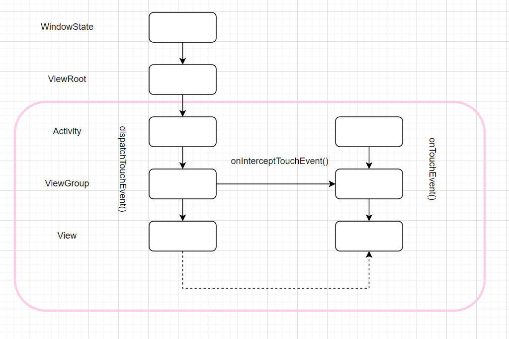

# 为验证Activity-Fragment结构下的生命周期变化

相对布局引用文件 : Activity-Fragment-Lifecycle.png

当然可以写(Linux中./，Windows中.\)，也可以直接省去相对路径。


## HomeFragment启动
### HomeFragment先于宿主Activity构建视图的
- HostActivity通知HomeFragment需要被加载
- HomeFragment构建视图 onAttach->onCreate->onCreateView->onViewCreated

### HostActivity构建
- HostActivity构建 onCreate
- HomeFragment收到通知 onActivityCreate->onStart
- HostActivity进入前台 onStart->onResume
- HomeFragment进入前台 onStart->onResume
- HostActivity添加到窗口 onAttachedToWindow

### HostActivity和HomeFragment进入后台菜单(注意Activity当前展示的Fragment不会销毁视图)
- HomeFragment进入后台 onPause->onStop
- HostFragment进入后台 onPause->onStop

### HostActivity和HomeFragment从后台菜单恢复(注意Activity当前展示的Fragment不会销毁视图)
- HomeFragment onStart-onResume
- HostActivity onStart-onResume


### HomeFragment跳转Non-HomeFragment（常规Fragment跳转逻辑）
- HomeFragment准备进入后台 onPause->onStop
- Non-Fragment准备进入前台 onAttach->onCreate->onCreateView->onViewCreated->onStart->onResume
- HomeFragment准备销毁视图 onDestroyView


### Non-HomeFragment启动Non-HostActivity（常规Activity跳转逻辑）
- Non-HomeFragment准备进入后台 onPause
- HostActivity准备进入后台 onPause
- Non-HostActivity准备进入前台 onCreate->onStart->onResume->onAttachToWindow
- Non-HomeFragment销毁视图 onStop->onDestroyView
- HostActivity完全进入后台 onStop


# 事件分发


事件分发实际上就是一个递归或者说责任链模型。

先不讨论事件怎么传递给Activity。

## 事件分发逻辑

### 默认事件分发逻辑

- 所有控件都是不响应事件的(clickable=false)

当所有的View都不响应事件，那么事件的默认分发流程（super.dispatchTouchEvent()）由Activity->ViewGroup->View，一直向子类传递。

- 其中某个环节响应事件(clickable=true)

那么事件的默认分发流程会在响应事件的控件处不再向下传递了，而是直接交由响应事件的控件的onTouchEvent处理。是否能够处理另说了。

### 修改默认事件分发流程

修改默认事件分发流程，也就是不再默认调用super.dispatchTouchEvent()，而是直接返回true或者false

- 所有控件都是不响应事件的(clickable=false)

事件分发到修改默认事件分发流程的控件处不会再向下传递了，而是进入了处理阶段了。根据结果状态分为两类情况：

1.true 表示从当前控件开始处理，也就是会调用当前控件的onTouchView

2.false 表示当前控件不处理无法处理这个事件，直接交由父类的onTouchView处理

由于修改默认事件分发逻辑的控件已经拦截了事件，而控件设置响应事件(clickable=true)，都是代表事件被拦截了。从事件分发过程，提前进入了事件处理过程了。

## 事件拦截逻辑

实际上，无论是控件设置clickable属性为true，还是修改了控件的dispatchTouchEvent()的默认逻辑，都是会拦截掉事件。事件不再继续向下分发，而是进入了处理阶段。

- dispatchTouchEvent中修改后的true会交给onTouchEvent处理，false会交给父控件的onTouchEvent处理
- clickable=true，则会将事件转交给当前view的onTouchEvent处理

另外，还有一种ViewGroup的onInterceptTouchEvent()，在没有之前拦截操作的情况下，会有以下几种情况：

- 默认逻辑，super.onInterceptTouchEvent()会继续向子类分发事件，也就是子类的dispatchTouchEvent被调用
- 修改逻辑，修改逻辑也是分为两种，都是拦截的意思，不会继续向子类分发事件了。true表示调用当前view的onTouchView，false表示调用父类的onTouchView

## 事件处理逻辑

实际上，事件分发逻辑只是为了寻找能够处理事件的控件，最终落脚点还是控件去处理事件，也就是控件的onTouchEvent了。

由于是一种递归/责任链模式，在传递的过程中分为两种情况：

- 没有上述三种拦截，View.dispachTouchEvent的默认逻辑是会直接将事件交由当前视图的onTouchEvent处理的
- 有拦截，则会从拦截点或者拦截点父类的onTouchEvent开始处理

事件开始处理了，但并不一定会处理掉，也就是被消费掉。这也是要根据onTouchView的返回值来确定，分为以下几种情况：

- onTouchView保持默认逻辑

分为两种情况，一是当前控件支持处理，也就是(clickable=true)，注意Button默认就是true。那么当前事件就会被处理/消耗掉。二是当前控件不支持处理，也就是(clickable=false)，注意Layout默认就是false。那么当前事件没被处理/消耗，而是转交给父类的onTouchView处理。

- onTouchView修改了默认逻辑

针对这一情况，也是分为两种。一是最终直接返回true，表示事件已经被处理了。无需再向上传递事件处理逻辑了。二是最终返回false，表示事件没有被处理/消耗，所以还是会继续向上传递事件处理逻辑，也就是父类控件的onTouchView就会被调用的。


## 注意事项


- 实际上，设置clickable属性、onTouchEvent的返回值谁先设置true谁优先。true/false则优先于super.onTouchEvent
- 当DOWN事件分发给某个控件时，会记录后续子事件的分发对象，不必再走完整的事件分发流程的。

```txt
2022-03-03 00:37:55.423 30294-30294/com.example.extend I/System.out: SophistNerd MessagerKt showPositionLog$default 
2022-03-03 00:37:56.902 30294-30294/com.example.extend I/System.out: SophistNerd CustomLinearLayout dispatchTouchEvent ACTION_DOWN
2022-03-03 00:37:56.902 30294-30294/com.example.extend I/System.out: SophistNerd CustomLinearLayout onInterceptTouchEvent ACTION_DOWN
2022-03-03 00:37:56.903 30294-30294/com.example.extend I/System.out: SophistNerd SwipeImageView dispatchTouchEvent ACTION_DOWN
2022-03-03 00:37:56.903 30294-30294/com.example.extend I/System.out: SophistNerd CustomLinearLayout onTouchEvent ACTION_DOWN
2022-03-03 00:37:56.919 30294-30294/com.example.extend I/System.out: SophistNerd CustomLinearLayout dispatchTouchEvent ACTION_MOVE
2022-03-03 00:37:56.920 30294-30294/com.example.extend I/System.out: SophistNerd CustomLinearLayout onTouchEvent ACTION_MOVE
2022-03-03 00:37:56.971 30294-30294/com.example.extend I/System.out: SophistNerd CustomLinearLayout dispatchTouchEvent ACTION_MOVE
2022-03-03 00:37:56.971 30294-30294/com.example.extend I/System.out: SophistNerd CustomLinearLayout onTouchEvent ACTION_MOVE
2022-03-03 00:37:56.991 30294-30294/com.example.extend I/System.out: SophistNerd CustomLinearLayout dispatchTouchEvent ACTION_UP
2022-03-03 00:37:56.991 30294-30294/com.example.extend I/System.out: SophistNerd CustomLinearLayout onTouchEvent ACTION_UP
```

- 上面有个问题，无论是事件分发dispatchTouchEvent还是事件处理onTouchEvent，如果修改默认值。true表示事件被消费了，false表示事件分发提前结束，或者事件处理不了！！！（坑啊）
