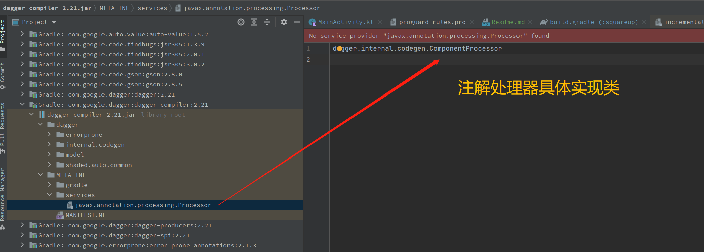
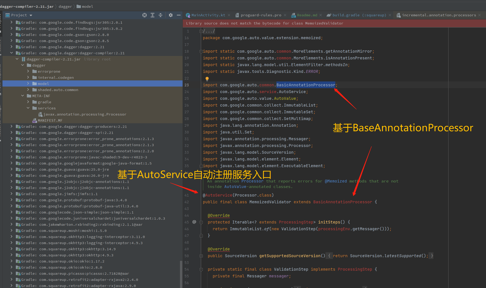
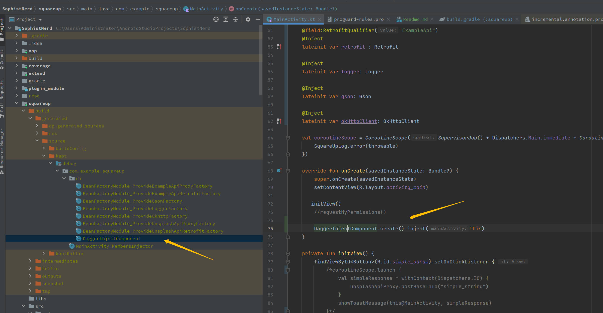
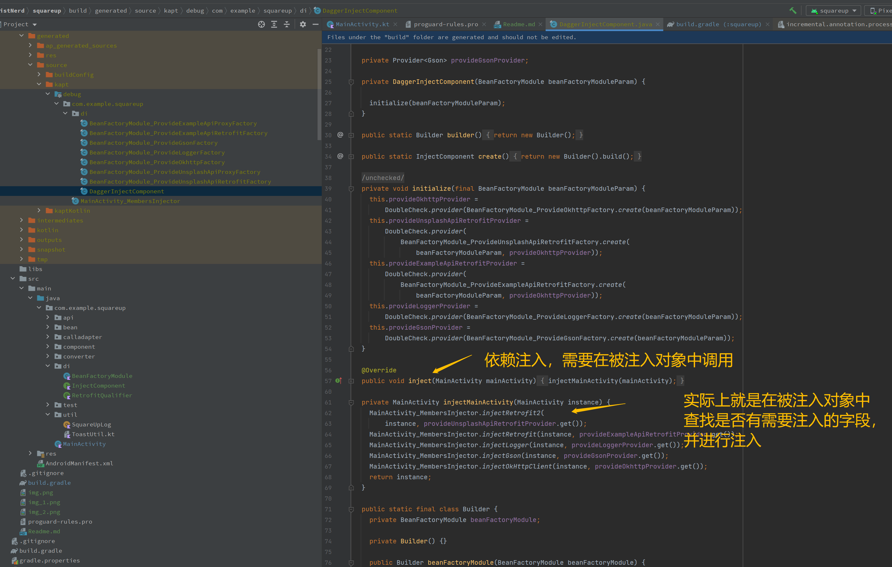
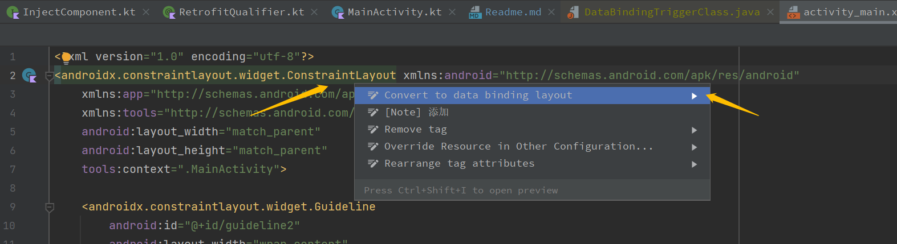
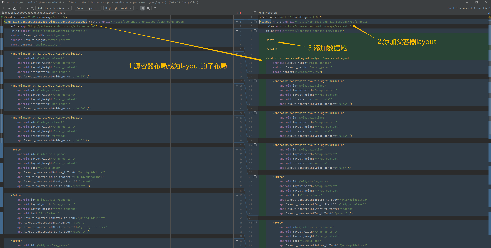
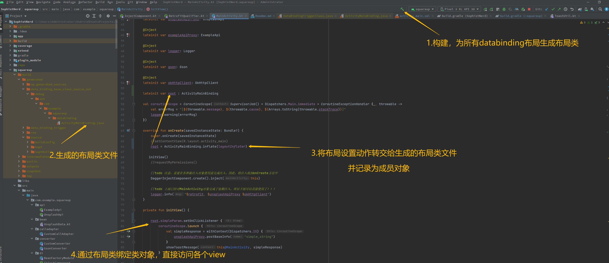
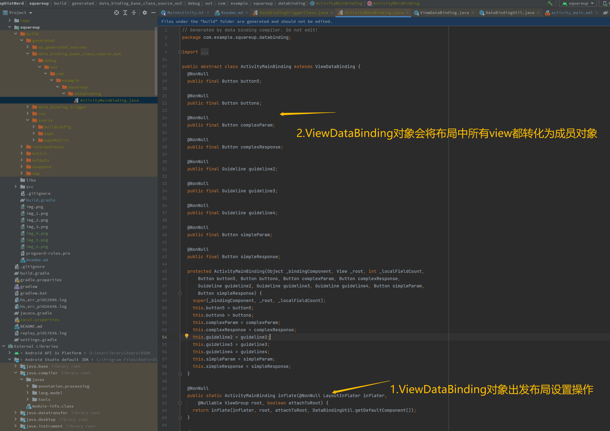

## Dagger2依赖注入的问题
### Named或者Qualifier注解在注入时的问题
- 依赖提供方
```kotlin
@Module
class BeanFactoryModule {

    @Singleton
    @Provides
    fun provideOkhttp() : OkHttpClient {
        return OkHttpClient.Builder()
            .connectTimeout(10, TimeUnit.SECONDS)
            .readTimeout(10, TimeUnit.SECONDS)
            .writeTimeout(10, TimeUnit.SECONDS)
            .retryOnConnectionFailure(true)
            .build()
    }

    @RetrofitQualifier("ExampleApi")
    @Singleton
    @Provides
    fun provideExampleApiRetrofit(okHttpClient: OkHttpClient) : Retrofit{
        return Retrofit.Builder()
            .baseUrl(ExampleApi.BASE_URL)
            .client(okHttpClient)
            .addConverterFactory(GsonConverterFactory.create())
            .build()
    }

    @RetrofitQualifier("UnsplashApi")
    @Singleton
    @Provides
    fun provideUnsplashApiRetrofit(okHttpClient: OkHttpClient) : Retrofit{
        return Retrofit.Builder()
            .baseUrl(UnsplashApi.BASE_URL)
            .client(okHttpClient)
            .addConverterFactory(GsonConverterFactory.create())
            .build()
    }
}
```
- 注解使用方
    - kotlin字段增加注解
```kotlin
class MainActivity : AppCompatActivity() {

    @field:RetrofitQualifier("UnsplashApi")
    @Inject
    lateinit var retrofit2: Retrofit

    @field:RetrofitQualifier("ExampleApi")
    @Inject
    lateinit var retrofit: Retrofit
}
```

    - kotlin函数增加注解
在BeanFactoryModule的provideExampleApiProxy使用时，给参数增加的@RetrofitQualifier("ExampleApi")限制
```kotlin
    @Singleton
    @Provides
    fun provideExampleApiProxy(@RetrofitQualifier("ExampleApi") retrofit: Retrofit) : ExampleApi {
       return retrofit.create(ExampleApi::class.java)
    }
    
    @Singleton
    @Provides
    fun provideUnsplashApiProxy(@RetrofitQualifier("UnsplashApi") retrofit: Retrofit) : UnsplashApi {
       return retrofit.create(UnsplashApi::class.java)
    }
```

### 依赖注入原理
实际上就是注解处理器，完成依赖的注入。
- 注解处理器
kapt实际上就是替代之前的annotationprocessor方式
```groovy
    //dagger依赖注入
    implementation 'com.google.dagger:dagger:2.21'
    kapt 'com.google.dagger:dagger-compiler:2.21'
```
可以通过将kapt改为implementation查看源码



- 生成的注入工具类


- 在依赖使用前进行注入
实际上，就是生成几个辅助类，完成依赖关系的注入。
 
  

## DataBinding原理
### 开启DataBinding编译选项
```groovy
android {

    //打开databinding，这里说明数据绑定库与 Android Gradle 插件捆绑在一起，和覆盖率插桩开关类似！！！
    buildFeatures {
        dataBinding true
    }
}
```

### 布局文件委托给DataBinding
在resource/layout中所有布局文件的顶级容器类按“alt——enter”，会有“Convert to databinding layout”



### Activity等使用布局的位置直接调用生成的Databinding类



详细使用，参考文档即可 https://cloud.tencent.com/developer/article/1909533


### 查看布局设置动作是如何转交的
直接查看生成的布局binding类文件的逻辑即可，分析源码即可。



## DataBinding是如何完成的
类似覆盖率插桩开关，还是在Android插件中找
